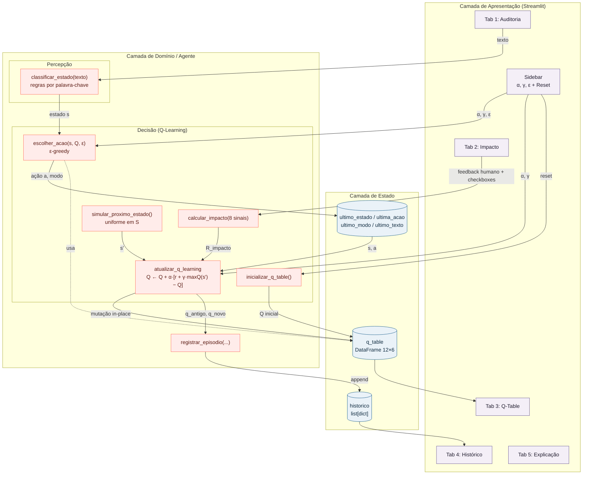
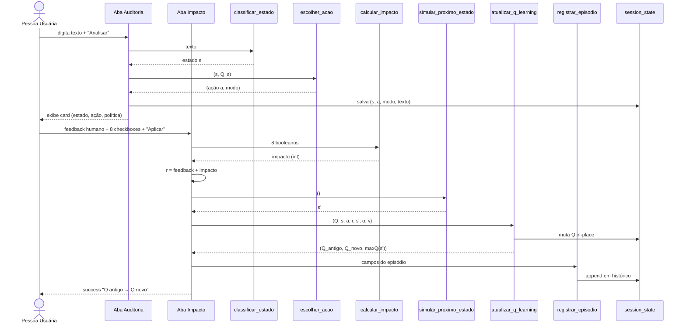
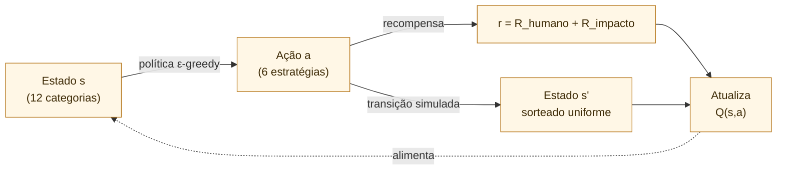

# ARQUITETURA.md — Athena-RL

> Modelagem arquitetural do projeto **athenarl**, derivada da análise documentada em `PROJETO_ANALISE.md`.
> Foco em camadas, componentes, fluxo de dados, dependências, regras de negócio e representação visual (Mermaid).

---

## 1. Descrição da arquitetura atual

O Athena-RL adota uma **arquitetura monolítica single-file** sobre o modelo de execução *script-rerun* do Streamlit. O código vive inteiramente em `app.py` (596 linhas), e a separação de responsabilidades é **lógica (por blocos de comentário) e não física (por módulos)**.

Conceitualmente, porém, três camadas estão claramente identificáveis no código e são reforçadas no texto acadêmico embutido na aba "Explicação":

1. **Camada de Apresentação (UI)** — Streamlit renderiza sidebar + 5 abas; cada interação humana dispara um *script rerun* completo.
2. **Camada de Domínio / Agente RL** — funções puras que implementam o ciclo MDP (estado → ação → recompensa → atualização), mais o classificador baseado em regras.
3. **Camada de Estado em Memória** — `st.session_state` mantém Q-Table, histórico e "última interação" persistentes dentro da sessão do navegador (mas voláteis entre sessões).

Não há camada de dados persistente (banco, arquivo), não há camada de integração externa, não há camada de autenticação. A aplicação é **stateful por sessão e stateless entre sessões**.

## 2. Camadas da aplicação

```
┌────────────────────────────────────────────────────────────────────┐
│  CAMADA DE APRESENTAÇÃO (UI)                                       │
│  - st.set_page_config, CSS injetado                                │
│  - Sidebar (hiperparâmetros α, γ, ε; botão reset)                  │
│  - 5 abas (Auditoria, Impacto, Q-Table, Histórico, Explicação)     │
└──────────────────────────┬─────────────────────────────────────────┘
                           │  lê/escreve
                           ▼
┌────────────────────────────────────────────────────────────────────┐
│  CAMADA DE ESTADO (st.session_state)                               │
│  - q_table: pd.DataFrame (12 estados × 6 ações)                    │
│  - historico: list[dict] de episódios                              │
│  - ultimo_estado / ultima_acao / ultimo_modo / ultimo_texto        │
└──────────────────────────┬─────────────────────────────────────────┘
                           │  é mutado por
                           ▼
┌────────────────────────────────────────────────────────────────────┐
│  CAMADA DE DOMÍNIO / AGENTE                                        │
│                                                                    │
│  Sub-camada de Percepção:                                          │
│   - classificar_estado(texto) → categoria                          │
│                                                                    │
│  Sub-camada de Decisão (Q-Learning):                               │
│   - inicializar_q_table()                                          │
│   - escolher_acao(estado, q_table, ε)                              │
│   - calcular_impacto(...)                                          │
│   - atualizar_q_learning(s, a, r, s', α, γ)                        │
│   - simular_proximo_estado()                                       │
│                                                                    │
│  Sub-camada de Registro:                                           │
│   - registrar_episodio(...)                                        │
└────────────────────────────────────────────────────────────────────┘
```

### Característica importante

Todo *callback* da UI (`if st.button(...)`) atua diretamente sobre as funções de domínio e sobre o `session_state`. **Não há controlador intermediário** — Streamlit funde view e controller no mesmo script.

## 3. Componentes principais

### 3.1 Componentes de Apresentação

| Componente | Localização | Responsabilidade |
|---|---|---|
| `set_page_config` | linhas 6–10 | Define metadados da página |
| Bloco de CSS | linhas 12–41 | Tematização visual |
| **Sidebar** | linhas 253–295 | Captura hiperparâmetros e dispara reset |
| **Tab 1 — Auditoria** | linhas 325–372 | Entrada de texto, exibição de classificação/ação |
| **Tab 2 — Impacto** | linhas 378–470 | Entrada de feedback e métricas, disparo da atualização |
| **Tab 3 — Q-Table** | linhas 476–494 | Visualização da matriz de aprendizado |
| **Tab 4 — Histórico** | linhas 500–513 | Tabela e gráficos temporais de episódios |
| **Tab 5 — Explicação** | linhas 519–595 | Documentação acadêmica em LaTeX/Markdown |

### 3.2 Componentes de Estado

| Chave em `session_state` | Tipo | Propósito |
|---|---|---|
| `q_table` | `pd.DataFrame (12×6)` | Matriz Q (estado × ação) |
| `historico` | `list[dict]` | Episódios completos com 11 campos cada |
| `ultimo_estado` | `str` | Estado `s` da interação corrente |
| `ultima_acao` | `str` | Ação `a` escolhida |
| `ultimo_modo` | `str` | `"Exploração"` ou `"Explotação"` |
| `ultimo_texto` | `str` | Texto original (necessário para o histórico) |

### 3.3 Componentes de Domínio

| Componente | Tipo | Entrada | Saída |
|---|---|---|---|
| `inicializar_q_table` | função pura | — | `pd.DataFrame` |
| `classificar_estado` | função pura (regras) | `texto: str` | `categoria: str` |
| `escolher_acao` | função estocástica | `(s, Q, ε)` | `(a, modo)` |
| `calcular_impacto` | função pura | 8 booleanos | `impacto: int` |
| `atualizar_q_learning` | função com efeito colateral em `Q` | `(Q, s, a, r, s', α, γ)` | `(Q_antigo, Q_novo, max Q(s', ·))` |
| `simular_proximo_estado` | função estocástica | — | `s': str` |
| `registrar_episodio` | função com efeito colateral em `historico` | 10 campos | — |

### 3.4 Constantes de domínio

| Constante | Cardinalidade | Papel |
|---|---|---|
| `CATEGORIES` | 12 | Espaço de estados `S` do MDP |
| `ACTIONS` | 6 | Espaço de ações `A` do MDP |
| `DEFAULT_ALPHA` | 0.30 | Taxa de aprendizado padrão |
| `DEFAULT_GAMMA` | 0.80 | Fator de desconto padrão |
| `DEFAULT_EPSILON` | 0.20 | Taxa de exploração padrão |

## 4. Relações entre módulos

Como tudo está no mesmo arquivo, as relações são **chamadas de função** disparadas a partir dos handlers da UI:

```
[Sidebar: sliders]  ────────────►  variáveis locais (α, γ, ε)
                                       │
                                       └──► escolher_acao, atualizar_q_learning

[Tab 1: botão "Analisar"]  ──►  classificar_estado(texto)
                                  └──►  escolher_acao(estado, Q, ε)
                                          └──►  session_state.ultimo_*

[Tab 2: botão "Aplicar recompensa"]
       └──►  calcular_impacto(...)
                └──►  recompensa_total = feedback + impacto
                        └──►  simular_proximo_estado()
                                └──►  atualizar_q_learning(...)
                                        └──►  registrar_episodio(...)

[Tab 3, 4]  ─────────────────────►  apenas LEEM session_state.q_table / historico

[Sidebar: botão "Reiniciar"]
       └──►  inicializar_q_table() + reset de chaves do session_state + st.rerun()
```

## 5. Fluxo de dados

### 5.1 Fluxo de uma interação completa (um episódio)

```
1.  Pessoa usuária digita TEXTO
        │
2.  TEXTO ── classificar_estado() ──► ESTADO (s)
        │
3.  (ESTADO, Q, ε) ── escolher_acao() ──► AÇÃO (a), MODO
        │
        ├──► session_state armazena (texto, estado, ação, modo)
        │
4.  Pessoa usuária fornece:
        - FEEDBACK_HUMANO (radio: -1.0 a +1.0)
        - 8 BOOLEANOS de métrica ambiental
        │
5.  BOOLEANOS ── calcular_impacto() ──► IMPACTO (int)
        │
6.  RECOMPENSA_TOTAL = FEEDBACK_HUMANO + IMPACTO
        │
7.  simular_proximo_estado() ──► PRÓXIMO_ESTADO (s')
        │
8.  (Q, s, a, r, s', α, γ) ── atualizar_q_learning() ──► Q' (mutação in-place)
        │
9.  registrar_episodio() acrescenta dict ao histórico
        │
10. UI rerun: abas Q-Table e Histórico refletem novo estado
```

### 5.2 Atualização matemática (núcleo do RL)

A fórmula implementada em `atualizar_q_learning` (linhas 183–193):

```
Q(s,a) ← Q(s,a) + α · [r + γ · max_a' Q(s', a') − Q(s,a)]
```

onde:

- `r = R_humano + R_impacto`
- `α` (alpha) ∈ [0.01, 1.00] — controlado pela sidebar
- `γ` (gamma) ∈ [0.00, 1.00] — controlado pela sidebar
- `s'` é sorteado uniformemente em `CATEGORIES` por `simular_proximo_estado()`

### 5.3 Política de seleção de ação

`escolher_acao` implementa **ε-greedy**:

```
se rand() < ε:  a ← uniforme(ACTIONS)       (Exploração)
caso contrário: a ← argmax_a Q(s, a)        (Explotação)
```

## 6. Dependências externas

### 6.1 Dependências de código

| Pacote | Importação | Uso |
|---|---|---|
| `streamlit` | `import streamlit as st` | UI, estado, layout, gráficos, LaTeX |
| `pandas` | `import pandas as pd` | DataFrame da Q-Table e histórico |
| `numpy` | `import numpy as np` | Geração aleatória, `seed`, `argmax` indireto |
| `datetime` (stdlib) | `from datetime import datetime` | Timestamp dos episódios |

### 6.2 Dependências de infraestrutura

- **Tempo de execução**: Python 3 + interpretador Streamlit rodando localmente (`streamlit run app.py`).
- **Browser**: o cliente é qualquer navegador que abra `http://localhost:8501`.

### 6.3 Dependências externas conceituais (não integradas)

A aba "Explicação" cita "GitHub, fórum técnico ou comunidade STEM" como ambiente. **Nenhuma dessas plataformas é tecnicamente integrada** — são domínios-alvo simbólicos.

### 6.4 Ausência de dependências críticas

- Sem banco de dados.
- Sem cache externo (Redis, Memcached).
- Sem API externa.
- Sem fila de mensagens.
- Sem autenticação/SSO.
- Sem telemetria/observabilidade externa.

## 7. Regras de negócio identificadas

### 7.1 Espaço de estados (12 categorias)

| Estado | Caráter |
|---|---|
| Discredit (Descrédito) | Agressão |
| Stereotyping (Estereótipos) | Agressão |
| Dominance (Dominação) | Agressão |
| Dismissing (Desprezo) | Agressão |
| Sexual Harassment | Agressão grave |
| Threats | Agressão grave |
| Maternal Insults | Agressão |
| Objectification | Agressão |
| Anti-LGBTQ+ | Agressão |
| Physical Appearance | Agressão |
| Moral Condemnation | Agressão |
| Neutral (Saudável) | Interação benigna (estado-alvo positivo) |

### 7.2 Espaço de ações (6 estratégias de mediação, em ordem crescente de severidade implícita)

1. Silêncio Operacional
2. Sugerir Reescrita Técnico-Pedagógica
3. Alerta de Viés Social
4. Intervenção Educativa Coletiva
5. Mediação Direta (Humano)
6. Reportar p/ Governança Institucional

### 7.3 Viés especialista codificado na Q-Table inicial (linhas 89–94)

| Estado | Ação recomendada inicial | Q inicial |
|---|---|---|
| Neutral (Saudável) | Silêncio Operacional | 1.20 |
| Discredit (Descrédito) | Sugerir Reescrita Técnico-Pedagógica | 1.00 |
| Stereotyping (Estereótipos) | Alerta de Viés Social | 1.00 |
| Dominance (Dominação) | Mediação Direta (Humano) | 1.00 |
| Sexual Harassment | Reportar p/ Governança Institucional | 1.30 |
| Threats | Reportar p/ Governança Institucional | 1.40 |

Essas células partem com valores mais altos que o intervalo aleatório `[0.1, 0.5]`, fazendo com que, antes de qualquer aprendizado, a política ε-greedy já tenda a escolher a ação "correta" para esses 6 estados.

### 7.4 Composição da recompensa

- **Feedback humano** (radio button): `+1.0`, `+0.5`, `0.0`, `-0.5`, `-1.0`.
- **Impacto ambiental** (soma de 8 booleanos):
  - `+5` se a pessoa afetada enviou novo PR depois
  - `+3` se a pessoa afetada continuou participando
  - `+2` se o comentário foi editado/reformulado
  - `+2` se o PR foi aceito
  - `+1` se a discussão continuou saudável
  - `-2` se o usuário reincidiu
  - `-3` se houve nova denúncia
  - `-5` se a pessoa afetada abandonou a discussão
- **Recompensa total**: `R = R_humano + R_impacto`.

### 7.5 Regra de classificação

Cada estado é detectado pela primeira correspondência (ordem de prioridade implícita no código) de **palavras-chave em substring**, no texto convertido para minúsculas. Default fallback: `Neutral (Saudável)`.

### 7.6 Estocasticidade

- `np.random.seed(42)` é fixado **apenas em `inicializar_q_table`**.
- Todas as outras chamadas a `np.random` (em `escolher_acao` e `simular_proximo_estado`) são **não-determinísticas** entre execuções, refletindo o caráter exploratório do agente.

## 8. Diagrama arquitetural (Mermaid)

### 8.1 Visão de componentes e fluxo principal



### 8.2 Diagrama de sequência — um episódio completo



### 8.3 Modelo conceitual MDP



## 9. Resumo executivo da arquitetura

| Dimensão | Estado atual |
|---|---|
| Estilo arquitetural | Monolito single-file sobre Streamlit |
| Camadas físicas | 1 (`app.py`) |
| Camadas lógicas | 3 (UI · Estado · Domínio) |
| Persistência | Apenas em memória (`st.session_state`); volátil entre sessões |
| Concorrência | 1 sessão por usuário; Streamlit rerun síncrono |
| Integrações externas | Nenhuma |
| Dependências runtime | `streamlit`, `pandas`, `numpy` (+ stdlib `datetime`) |
| Algoritmo central | Q-Learning tabular com política ε-greedy |
| Modelo de domínio | MDP discreto: `|S| = 12`, `|A| = 6`, recompensa composta |
| Pontos de extensão naturais | substituir `classificar_estado` (PLN/modelo); persistir Q-Table; alimentar `s'` real em vez de simulado |

---

**Arquivo gerado em**: 2026-06-03
**Branch analisada**: `v.2`
**Commit base**: `1710aac`
